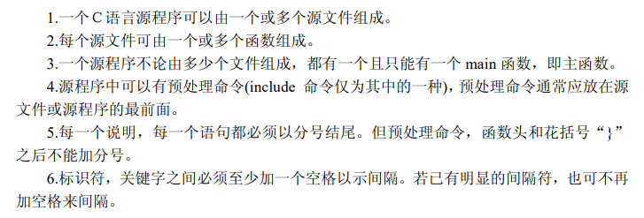
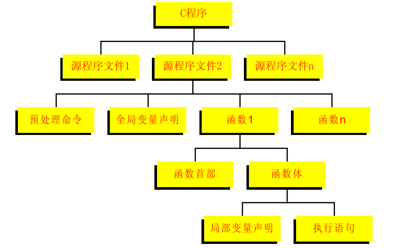

# C语言程序构成

## ==**C语言全是由一个个函数构成**==

- `include` 文件包含命令，表示把 `<>` 内的文件包含进来，可以用其中的函数（库函数）。编译时编译器会将其编译。

- 一个程序是由多个函数组成，必须有一个主函数`main` 。

- 每个函数前需要有类型说明符，表示函数返回的数据类型。

# C语言函数构成 

- 说明部分

- 执行部分

  C语言程序中的所遇到的所有变量必须先说明，后使用。

# C语言程序的结构特点

- C语言结构

