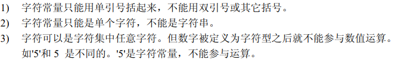

# 对变量的定义包括

- 数据类型

- 存储类型

- 作用域

## 数据类型 

## 常量与变量

- 常量，程序执行过程中其值不发生改变的量称为常量。包括

  - 直接常量
  - 符号常量（使用前先定义，一般形式为 `#define 标识符 常量` ）

- 变量，其值可以改变的量称为变量。一个变量应该有一个名字，在内存中占据一定的存储单元。 变量定义必须放在变量使用之前。

  

## 整型变量

- 基本型，`int`
- 短整型，`short int`或`short`
- 长整型，`long int`或`long`
- 无符号整型，`unsigned`，包括`unsigned int`, `unsigned short`, `unsigned long`。

各类型表示范围：

### 整型数据的溢出*

## 实型变量

1. 实型数据的存放形式

   - 按指数形式存储，包括小数部分和指数部分。

2. 实型变量的分类

   - 单精度，`float`
   - 双精度，`double`
   - 长双精度，`long double`

   范围如下

   

3. 实型数据舍入误差

### 字符变量

**实际上字符值是以ASCII码的形式存储在变量的内存单元中**

- 字符常量特点

  

- 转义字符

  

### 字符串常量

- 与字符常量的区别

  
  
### 各类数值型数据之间的混合运算

- 自动转换

  
  
- 强制类型转换

  

# 运算符

